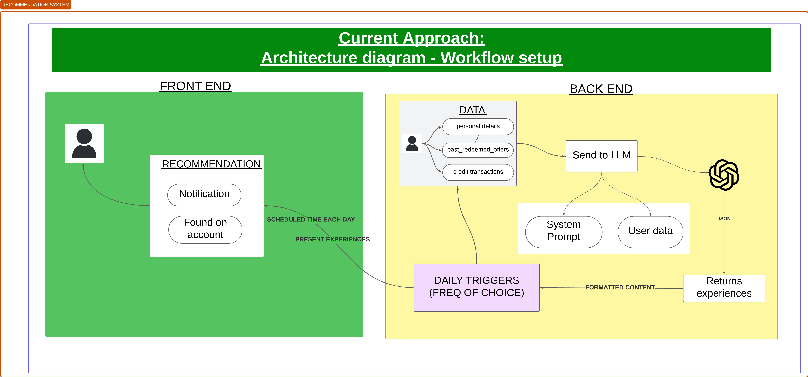

# AI Recommendation Service

[](https://meg-patakota.github.io)
[](https://meg-patakota.github.io)
[](https://github.com/yourusername/genai-recommendations)

> ⚠️ **Disclaimer:** This project is an ongoing project. Code, features, and documentation may evolve as the solution matures.

## Table of Contents
- [Overview](#overview)
- [Installation](#installation)
- [Prompt Design and Architecture](#prompt-design-and-architecture)
- [Data Structure](#data-structure)
- [API Integration](#api-integration)
- [Next Steps](#next-steps)
- [Contributing](#contributing)

## [Read full documentation ](./docs/documentation.md)
Further details on: Prompt/Model Approach, Data Integration, System Design, Trade-Offs & Next Steps

---

## Overview

This project leverages **Generative AI (GenAI)** to deliver personalised experience recommendations to members based on:
- Their **profile information** (e.g., location, name).
- **Past redeemed offers** and **recent transactions**.
- Available experiences yet to be redeemed.



The service consists of:
1. **Backend Services**:
   - A Jinja2-based template system to dynamically create LLM-friendly prompts.
   - An integration with OpenAI's GPT models for natural language recommendations.
2. **Frontend**:
   - A simple **Streamlit UI** for user interaction and viewing recommendations.
3. **Deployment**:
   - Dockerised services for portability and ease of deployment.

---

## Installation

Prerequisites:
- Docker
- Python 3.13
- Poetry

Clone the repository and set up the environment using **Poetry**:

```bash
# Clone the repository
git clone https://github.com/yourusername/genai-recommendations.git
cd genai-recommendations

# Install dependencies for both backend and frontend 
cd backend 
poetry install
cd ..
cd frontend
poetry install

# Run the application. Make sure your docker image is build and is running. Then, try with input user ID `M001` or `M002` to see the recommendations.
cd frontend
poetry run streamlit run app.py
```

Now START your docker, build and run your docker container:

```bash
cd backend # go back by using 'cd ..' if you are in the frontend
docker build -t genai-recommendations .
docker run -e OPENAI_API_KEY=<insert-your-api-key> -p 8000:8000 genai-recommendations
```

Now, that you have your docker container running, you can access the streamlit app.

---

## Architecture
### Core Flow

1. **utils.py**:
   - Loads synthetic data from `data.json`.
   - Prepares the LLM-ready prompt via Jinja2.
   - Calls OpenAI GPT to fetch structured recommendations.

2. **app.py**:
   - Provides a **Streamlit-based interface** for users to input member IDs and view personalised recommendations.

---

## Data Structure

### Synthetic Dataset

The dataset includes:
1. **Members**:
   - `member_id`, `name`, `location`, `past_redeemed_offers`, and `card_transactions`.
2. **Experiences**:
   - `experience_id`, `title`, `category`, descriptions, price range, and availability dates.

Sample:
```json
{
    "members": [
        {
            "member_id": "M001",
            "name": "Alice",
            "location": "London",
            "past_redeemed_offers": [...],
            "card_transactions": [...]
        }
    ],
    "experiences": [
        {
            "experience_id": "E001",
            "title": "Gourmet Sushi Tasting",
            "category": "Food",
            "rating": 4.8,
            "available_dates": [...]
        }
    ]
}
```
---

## API Integration

The project includes a basic **FastAPI-based recommendation API**. 

### Endpoint

#### `/recommendations/{member_id}`
Fetches recommendations for a specific member.

- **Parameters**:  
  - `member_id` (path): Unique identifier for the member.
  - `output` (query): Format of response (`json` or `text`).

- **Response**:
  ```json
  {
      "member_id": "M001",
      "recommendations": [
          {
              "title": "Gourmet Sushi Tasting",
              "category": "Food",
              "explanation": "Based on your interest in high-end dining experiences..."
          }
      ]
  }
  ```

---

## Next Steps

[Read more on TradeOffs & Next Steps](/docs/documentation.md).
---

## Contributing

Contributions are welcome! Please follow the guidelines below:
1. Fork the repository.
2. Open an issue for discussion.
3. Submit a Pull Request with detailed descriptions of changes.

I look forward to seeing how this project evolves with community input. Contact me via [my website](https://megpatakota.co.uk) for further discussions or suggestions.

---

## License

This project is maintained by **Meg Patakota**. All rights reserved. Not licensed for use or redistribution without explicit permission.
